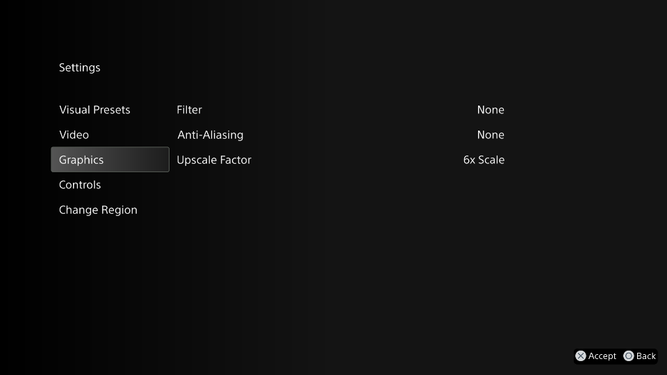
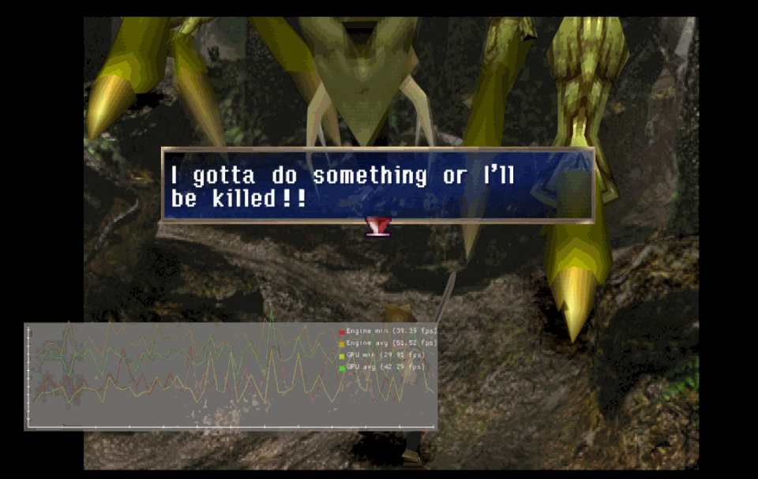

# PS1HD

_Notes from investigating the official PlayStation 1 emulator for the PlayStation 4 and PlayStation 5 systems_

## Background

PlayStation returned to classic system emulation with the launch of a refreshed PlayStation Plus tiered subscription service in mid 2022. New PS1 (PlayStation 1) and PSP (PlayStation Portable) emulators were introduced, which included support for rendering the emulated games at higher resolution, support for save states and instant rewind, along with support for earning PlayStation trophies.

This repository focuses on the PS1 emulator, dubbed "PS1HD", and attempts to take a look under the hood through the benefits of custom firmware on the PS4.  

Official PS1 emulation on PlayStation 4 was a long time coming. [Digital Foundry had reported in January 2014](https://www.eurogamer.net/digitalfoundry-2014-ps1-ps2-games-heading-to-ps4) that sources within Sony had confirmed there were plans to release PS1 and PS2 titles running under local emulation on the PS4, with the potential of the emulation applying visual enhancements.  

While the first emulated PS2 titles eventually arrived in November 2015, the PS1 emulator remained elusive. Perhaps deferred in favour of the somewhat ill-fated PlayStation Classic mini-console, which released in December 2018 and had [opted to use the open source PCSX ReArmed emulator](https://doc.dl.playstation.net/doc/psclassic-oss/PCSX_ReARMed.html) instead of an in-house Sony developed one, the PS1 emulator for PS4 finally broke cover in October 2019. Bundled inside the MediEvil remake, this was likely the first public release of PS1HD, and it enabled players access to the original PS1 version of MediEvil as a reward for completing tasks within the new game.

PS1 emulation on PS4 (and also PS5) finally become a reality in May 2022, some 8 years after it was first reported as being in the works, with the release of 13 PS1 titles. To date 33 titles have been released from publishers including SIE, Namco, Disney and Capcpom.

## PS1HD Versions

| Version | Date | Game | Notes |
| -- | -- | -- | -- |
| ? | ~June 2019 | MediEvil | Bundled with MediEvil (2019) PS4 Limited compatibility outside of MediEvil |
| ? | ~April 2022 | 13 PS1 titles PS+ relaunch | New UI for accessing save states and rewind Trophy support Much broader game compatibility |
| ? | ~Sept 2022 | Syphon Filter 2 | European and American releases now include both NTSC & PAL as standard New UI for switching region
| 1.4.6715 | ~Feb 2023 | Legend of Dragoon |
| ? | ~Oct 2023 | Worms World Party |New UI to toggle PAL frame blending Save state slots increased to 20 (up from 6)

## PS1HD Version 1.4.6715

### Config Files
The emulator attempts to load configuration files from the following locations. These locations are relative to the applications sandbox.  

The application outputs configuration to `klog` as it is read from these locations in the following order. 

| Path | Notes |
| -- | -- |
| `/app0/conf/package-ps4.conf` | _Not present_ |
| `/app0/revision.conf` | `--git-rev-gamedata` |
| `/app0/config-title.txt` | Bulk of emulator configuration is stored here |
| `/app0/SIEA/config-region.txt` | `SIEA` path is defined by the presence of `--region-dir=SIEA` in `config-title.txt` |
| `/app0/.config-local.txt` | _Not present_ |
| `/app0/.config-local-PS1HD.txt` | _Not present_ |
| `/temp0/reboot-params.txt` | Special file created by the application after switching regions It is transient in nature; but can persist for extended periods |
| `imgui_emu_option.json` | This file is located in the users application Save Data |

### Script Files
The emulator loads and executes LUA script files. These files can also make alternations to the emulators configuration through `EM_SetSettingCli()`.  

Scripts seem to be loaded per directory in alphabetical order.

| Path | Notes |
| -- | -- |
| /app0/app_boot.lua | _Not present_ |
| /app0/SIEA/app_boot.lua | `SIEA` path is defined by the presence of `--region-dir=SIEA` in `config-title.txt` |
| /app0/global/scripts/* | `global` path is defined by presence of `--globalgamedata-dir=global` in `config-title.txt` |
| /app0/scripts/* | "Scans" for scripts |

### /temp0/reboot-params.txt
This file seems to appear in versions of the emulator released following Syphon Filter 2, when support was added to enable the user to switch between the NTSC and PAL version of a game.  

When the user accesses that option the file is created with content such as the following, which enables the emulator to reboot and load with additional command line arguments passed through to it. This example loads the PAL version.    

    --request-ntsc-region=0
    --boot-disc-id=0

The file is transient, but it does seem to hang around for a while. The emulator does not delete the file once the region has been switched. The file also persists if you exit the application and then launch it again, however if you exit and launch another application and then return to the PS1 game the file will now be deleted. Restarting the console will also result in this file (and all files in `/temp0`) being deleted.

> For users of custom firmware, when packaging your own PS1 games for use with the PS1HD emulator creating this file provides a convenient way to test or alter your emulator configuration without having to re-package your game. Run your game, create the file within the games sandbox directory, and then close and start the game again. Any configuration you've added to the file will be added to the emulators command line.

## Emulator Commands

### --userui-settings-graphics

    --userui-settings-graphics=1    // enabled
    --userui-settings-graphics=0    // disabled

This enables an additional `Graphics` menu option in the main user menu. This allows the user to adjust the resolution upscale factor, filter, and anti-aliasing settings.

With these settings now visible it is possible to see what each of the visual presets are using. Note these are from _Legend of Dragoon_ and so may vary by title, and emulator version.

| Visual Preset | Filter | AA | Upscale Factor |
| -- | -- | -- | -- |
| Default | None | None | 6x |
| Retro Classic | Cubic | None | 2x |
| Modern | Lanczos | CMAA | 6x |

When changing the upscale factor the new frame buffer size is printed to `klog`.

| Upscale Factor | Frame Buffer | Output |
| -- | -- | -- |
| No Scale | 1024 x 512 | `(GPU)  resetScale(1, AAMode::NoAA): framebuffer=1024,512` |
| 2x | 2048 x 1024 | `(GPU)  resetScale(2, AAMode::NoAA): framebuffer=2048,1024` |
| 3x | 3072 x 1536 | `(GPU)  resetScale(3, AAMode::NoAA): framebuffer=3072,1536` |
| 4x | 4096 x 2048 | `(GPU)  resetScale(4, AAMode::NoAA): framebuffer=4096,2048` |
| 5x | 5120 x 2560 | `(GPU)  resetScale(5, AAMode::NoAA): framebuffer=5120,2560` |
| 6x | 6144 x 3072 | `(GPU)  resetScale(6, AAMode::NoAA): framebuffer=6144,3072` |

### --show-fps-graph

    --show-fps-graph

### --enable-change-disc-ui

    --enable-change-disc-ui=1       // enabled
    --enable-change-disc-ui=0       // disabled